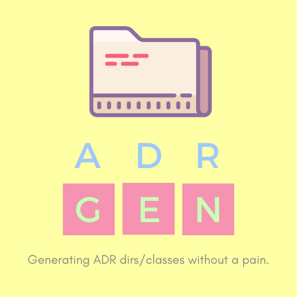

<p align="center">
  
</p>

<p align="center">
  
</p>

<p align="center">
  <a href="#installation">Installation</a>
  |
  <a href="#usage">Usage</a>
  |
  <a href="#license">License</a>
</p>

<h1></h1>

**The simplest and best generator ADR classes and directories**

<a name="installation"></a>

## Installation

### Prerequisites

- PHP 7.3 or newer
- Composer

### Getting Started

1. Install as a global package
  ```sh
  composer global require durdev/adrgen
  ```

2. Make sure your global vendor binaries dir is in your $PATH
  - Print the global composer binaries dir
  ```sh
    composer global config bin-dir --absolute
  ```

  - Copy the path to your bashrc (or zshrc or any *rc file)
  ```sh
    echo 'export PATH="$PATH:$HOME/path/to/composer/vendor/bin"' >> ~/.bashrc && source ~/.bashrc
  ```

Now that's all good to go.

<a name="usage"></a>

## Commands and usage

| Command                 | Description                                | Options                    | Arguments  |
| ------------------------| ------------------------------------------ | ---------------------------| -----------|
| adrgen make:crud        | Generates the basic CRUD operations files  | --actions-dir              | model      |

### Details
1. **--actions-dir**: your directory that will be the root folder for ADR actions directories
2. **model**: the model's name to be created

Example:
```sh
adrgen make:crud user --actions-dir=/var/www/project/actions
```

### The default template created

    /var/www/project/actions                # Actions dir
    ├── (D) User                            # Capitalized model
    │   ├── (D) Index                       # Action dir
    |   |   ├── (F) IndexUserAction.php     # Action file
    |   |   └── (F) IndexUserResponder.php  # Responder file
    │   ├── (D) Create
    |   |   ├── (F) CreateUserAction.php
    |   |   └── (F) CreateUserResponder.php
    │   ├── (D) Store
    |   |   ├── (F) StoreUserAction.php
    |   |   └── (F) StoreUserResponder.php
    │   ├── (D) Edit
    |   |   ├── (F) EditUserAction.php
    |   |   └── (F) EditUserResponder.php
    │   ├── (D) Update
    |   |   ├── (F) UpdateUserAction.php
    |   |   └── (F) UpdateUserResponder.php
    │   ├── (D) Delete
    |   |   ├── (F) DeleteUserAction.php
    └── └──   └── (F) DeleteUserResponder.php

<a name="license"></a>

## License

MIT
